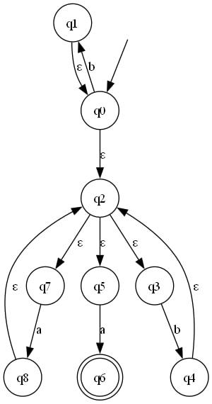
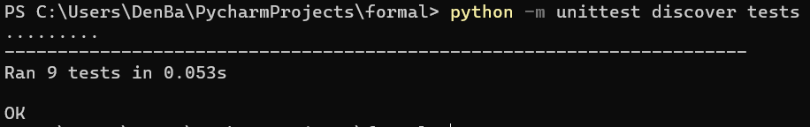

# Симуляция операций над конечными автоматами

Барилов Денис Игоревич
Б05-322

## Сборка

### Основная часть

#### Для Windows:

1. Откройте командную строку (Command Prompt).
2. Перейдите в корневую директорию проекта, где расположен файл `requirements.txt`:
   ```bash
   cd путь\к\проекту
   ```
3. Выполните следующую команду для установки зависимостей:
   ```bash
   pip install -r requirements.txt
   ```

### Для Linux:

1. Откройте терминал.
2. Перейдите в корневую директорию проекта, где расположен файл `requirements.txt`:
   ```bash
   cd путь/к/проекту
   ```
3. Выполните следующую команду для установки зависимостей:
   ```bash
   pip install -r requirements.txt
   ```

#### Визуализация автоматов

Для отображения визуализации конечных автоматов в виде графов (представление и сохранение в формате png) дополнительно потребуется установить отдельную программу graphviz (в дополнение к одноименной библиотеке). Библиотека свяжется с ней и сможет корректно отображать графы.



*Пример визуализации НКА.*

1. Скачайте нужную версию с официального сайта  https://graphviz.org/download/ .
2. Запустите загрузчик. Отметьте галочкой пункт `Добавить в переменную Path` (или подобный).
3. Если программа не добавится в Path автоматически, сделайте это вручную.
4. Проставьте флаг `installed` в начале файла [`graph.py`](interface/graph.py).

## Структура проекта

Проект организован в несколько директорий и файлов, каждый из которых выполняет определенную задачу. 

- **models/**
  - Директория, определяющая основные модели, используемые в проекте.
  - [`auto.py`](models/auto.py) - Содержит основную модель для автомата.
  - [`bidirectional.py`](models/bidirectional.py) - Вспомогательная модель.
  
- **facade/**
  - [`nfa.py`](facade/nfa.py) - Фасадный класс для НКА
  - [`dfa.py`](facade/dfa.py) - Фасадный класс для ДКА

- **operations/**
  - Директория, включающая модули для различных операций, связанных с автоматами.
  - [`basic.py`](operations/basic.py) - Содержит базовые операции составления НКА.
  - [`poland.py`](operations/poland.py) - Отвечает за создание польской нотации и автомата по ней.
  - [`transform.py`](operations/transform.py) - Реализует сложные операции над автоматами.
  - [`regexify.py`](operations/regexify.py) - Преобразует автомат в соответствующее регулярное выражение.

- **interface/**
  - Директория, включающая модули для взаимодействия с пользователем и обработки ввода/вывода.
  - [`graph.py`](interface/graph.py) - Содержит функциональность для визуализации автоматов в виде графов.
  - [`loader.py`](interface/loader.py) - Отвечает за загрузку и выгрузку JSON-файлов.
  - [`tables.py`](interface/tables.py) - Выводит и сохраняет таблицы, описывающие процессы операций над автоматами.
  - [`text.py`](interface/text.py) - Управляет загрузкой и выгрузкой текстовых (TXT) файлов.

- **input/** 
  - Директория, содержащая файлы, которые предполагается читать программе.
  - [`auto.json`](input/auto.json) - JSON-файл, содержащий конфигурации автомата для демонстрации.
  - [`nfa.txt`](input/nfa.txt) - Текстовый файл, содержащий конфигурацию НКА для примера.
  - [`dfa.txt`](input/dfa.txt) - Текстовый файл, содержащий конфигурацию ДКА для примера.

- **output/**
  - Директория, содержащая файлы, сгенерированные в процессе выполнения программы.
  - **graph/** - Поддиректория для хранения файлов визуализации автоматов.
  - **tables/** - Поддиректория для хранения файлов, содержащих LaTex таблицы.
  
- **tests/**
  - Директория, содержащая юнит-тесты для проекта.

- [`main.py`](tests/main.py) - Пример файла, демонстрирующего взаимодействие с библиотекой.
- [`README.md`](README.md) - Документация проекта.
- [`requirements.txt`](requirements.txt) - Список зависимостей.
- [`example.jpg`](example.jpg) - Фотография-пример для документации.
- [`example.jpg`](example.jpg) - Скриншот пройденных тестов для документации.
- [`example.jpg`](example.jpg) - Игнорируемые файлы.


## Рализованные операции

### Manual

В виде взаимодействия с классом Automaton реализованы следующие функции (приведены основные):

## Реализованные функции

### Регулярное выражение → Польская нотация
- Функция, преобразующая регулярное выражение в польскую нотацию. 
- `to_polish_notation` в файле [poland.py](operations/poland.py).

### Польская нотация → НКА
- Функция, создающая недетерминированный конечный автомат (НКА) на основе заданной польской нотации. 
- `polska_into_auto` в файле [poland.py](operations/poland.py).

### НКА → ДКА
- Функция, преобразующая недетерминированный конечный автомат (НКА) в детерминированный конечный автомат (ДКА). 
- `determinate` в файле [transform.py](operations/transform.py).

### ДКА → ПДКА
- Функция, преобразующая детерминированный конечный автомат (ДКА) в полный детерминированный конечный автомат (ПДКА). 
- Реализовано в файле [transform.py](operations/transform.py).

### ПДКА → МПДКА
- Функция, минимизирующая полный детерминированный конечное автомат (ПДКА).
- `make_complete` в файле [transform.py](operations/transform.py).

### (МПД)КА → Регулярное выражение
- Функция, получающая регулярное выражение по данному конечному автомату.
- `to_regex` в файле [regexify.py](operations/regexify.py).

### (М)ПДКА → (М)ПДКА дополнения
- Функция, создающая автомат-дополнение к полному детерминированному конечному автомату (ПДКА).
- `complement` в файле [transform.py](operations/transform.py).


### Facade

Кроме того реализованы фасад-классы NFA и DFA, позволяющие производить операции над КА с помощью методов объекта. 

## Класс NFA

- `__init__(self, text: Optional[str] = None)`: Инициализирует объект класса `NFA` по текстовой конфигурации.
  
- `process(self, word: str) -> bool`: Проверяет, принимает ли автомат данное слово `word`.

- `print(self)`: Выводит строковое представление автомата.

- `save(self, path: Union[str, Path])`: Сохраняет конфигурацию автомата в файл по указанному пути.

- `by_regex(text: str) -> 'NFA'`: Статический метод, создающий автомат по заданному регулярному выражению `text`.

- `regex(self) -> str`: Возвращает регулярное выражение, соответствующее автомату.

- `visualize(self)`: Визуализирует автомат.

## Класс DFA (наследуется от NFA)

- `__init__(self, text: Optional[str] = None)`: Инициализирует объект класса `DFA` по текстовой конфигурации.

- `process(self, word: str) -> bool`: Проверяет, принимает ли автомат данное слово `word`.

- `print(self)`: Выводит строковое представление детерминированного автомата.

- `save(self, path: Union[str, Path])`: Сохраняет детерминированный автомат в файл по указанному пути.

- `by_regex(text: str) -> 'DFA'`: Статический метод, создающий детерминированный автомат по заданному регулярному выражению `text`.

- `by_nfa(nfa: NFA, print_process: bool = False) -> 'DFA'`: Статический метод, создающий ДКА по НКА `nfa`.

- `minimize(self, print_process: bool = False) -> 'DFA'`: Минимизирует детерминированный автомат.

- `visualize(self)`: Визуализирует детерминированный автомат.

- `complement(self) -> 'DFA'`: Преобразовывает ПДКА в ПДКА-дополнение к исходному.

# Примечания

### Примеры

В файле main.py можно найти примеры взаимодействия с автоматами как в функциональном (manual), так и в объектном (facade) стилях.

### Формат регулярного выражения

В регулярном выражении могут встречаться следующие операции:

- `*` - звезда Клини
- `^` - плюс Клини
- `+` - плюс (объединение)
- `.` - явное умножение (конкатенация)
- неявное умножение (конкатенация)

Эпсилон `ε` записывается как нижнее подчеркивание - `_`.

### Пройденные тесты


